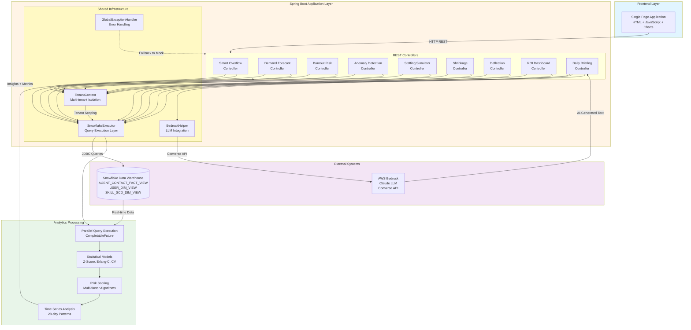
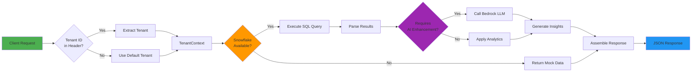
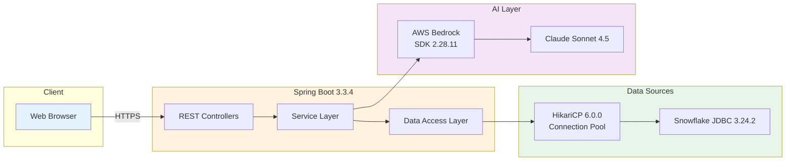
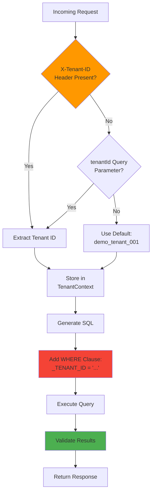
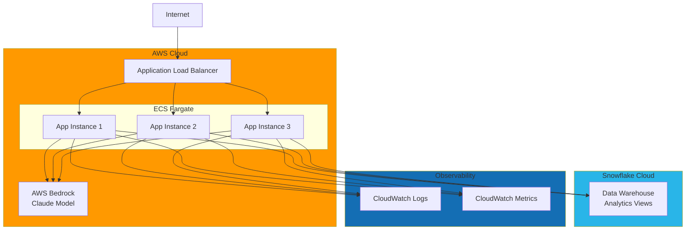
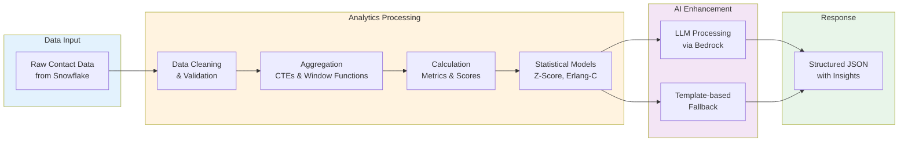

# Architecture Flowchart - Agentic RCA Sample Platform

This diagram illustrates the system architecture and data flow for the AI-powered contact center analytics platform.

## System Architecture Diagram



## Data Flow Sequence



## Module Architecture Pattern

Each analytics module follows this consistent pattern:

```mermaid
flowchart TB
    subgraph Module["Analytics Module Pattern"]
        Controller[Controller<br/>@RestController]
        
        Controller --> Check{Snowflake<br/>Configured?}
        
        Check -->|No| Mock[buildMockResponse]
        Check -->|Yes| Live[buildLiveResponse]
        
        Live --> Query[Execute Snowflake Query]
        Query --> Process[Process Data]
        Process --> Analytics[Apply Module Logic]
        
        Analytics --> Response[Assemble Response]
        Mock --> Response
        
        Response --> Return[Return JSON]
    end
    
    style Controller fill:#42A5F5
    style Check fill:#FFA726
    style Analytics fill:#66BB6A
    style Response fill:#AB47BC
```

## Key Design Principles

1. **Graceful Degradation**: Every module has mock data fallback
2. **Tenant Isolation**: All queries filtered by `_TENANT_ID`
3. **Parallel Execution**: CompletableFuture for concurrent Snowflake queries
4. **Single Responsibility**: Each controller handles one analytics capability
5. **Fail-Safe**: No external dependency failure causes 500 errors

## Technology Stack Flow



## Security & Multi-Tenancy



## Deployment Architecture



## Analytics Processing Pipeline



---

**Diagram Notes:**
- All diagrams use Mermaid syntax for easy rendering in GitHub, GitLab, and documentation tools
- Flowcharts illustrate request flow, data processing, and system interactions
- Color coding: Blue (input), Orange (processing), Purple (AI), Green (output), Yellow (infrastructure)
