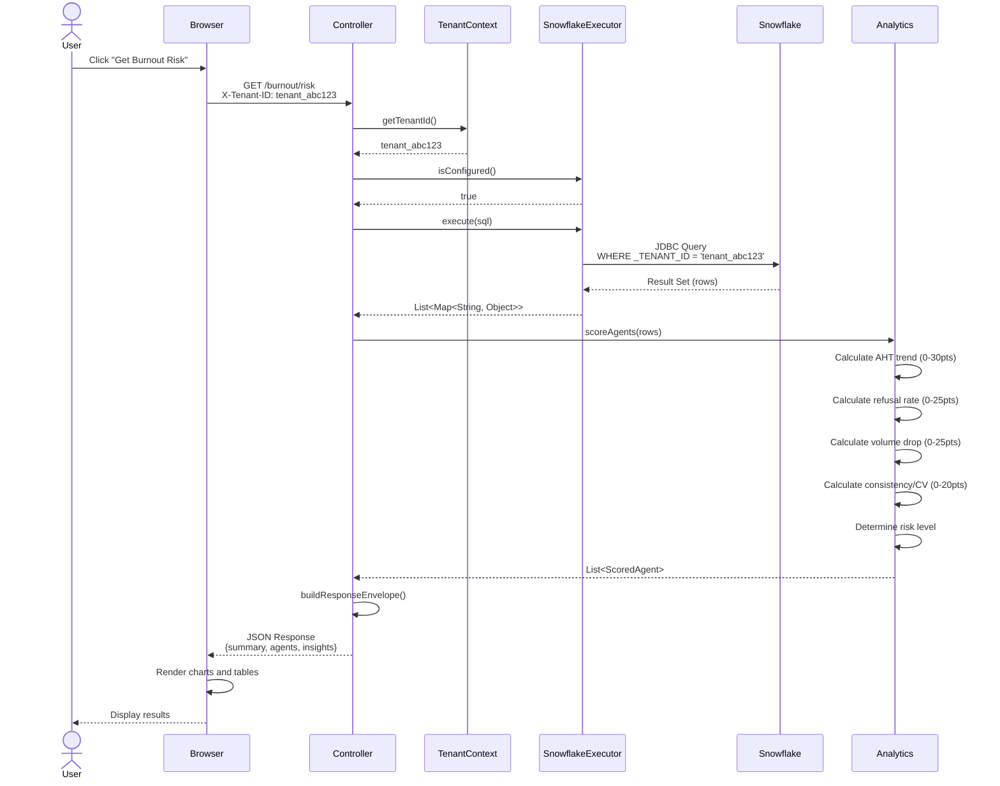
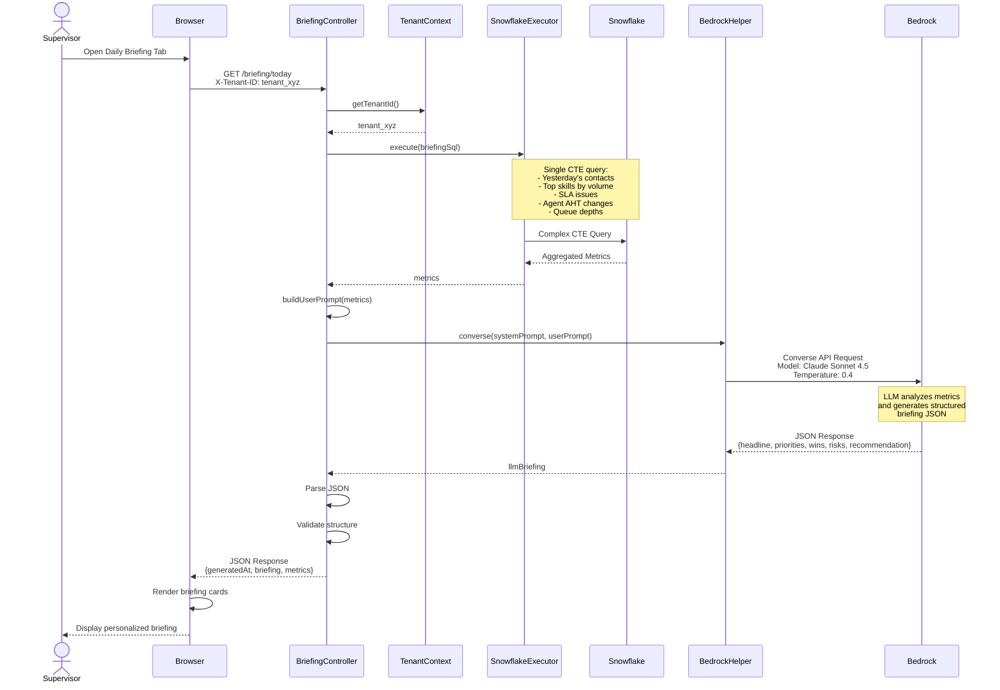
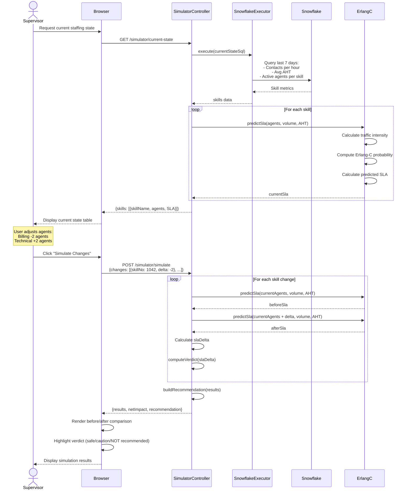
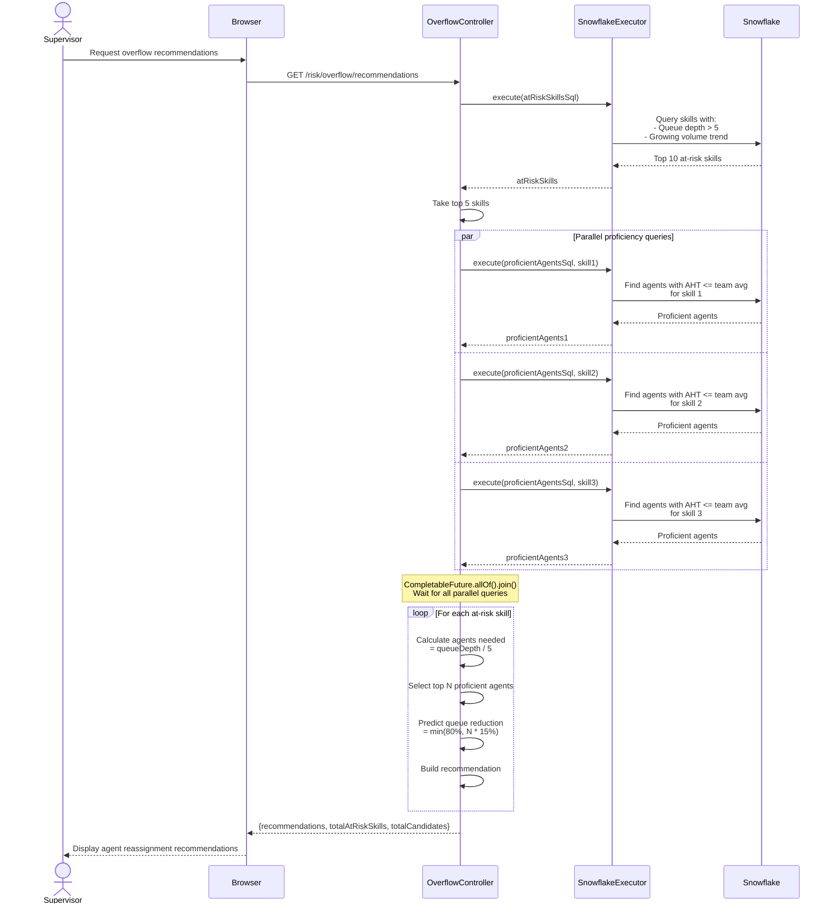
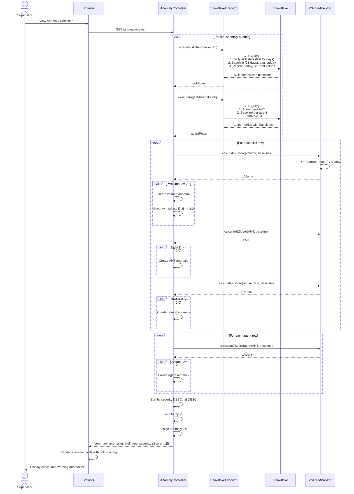
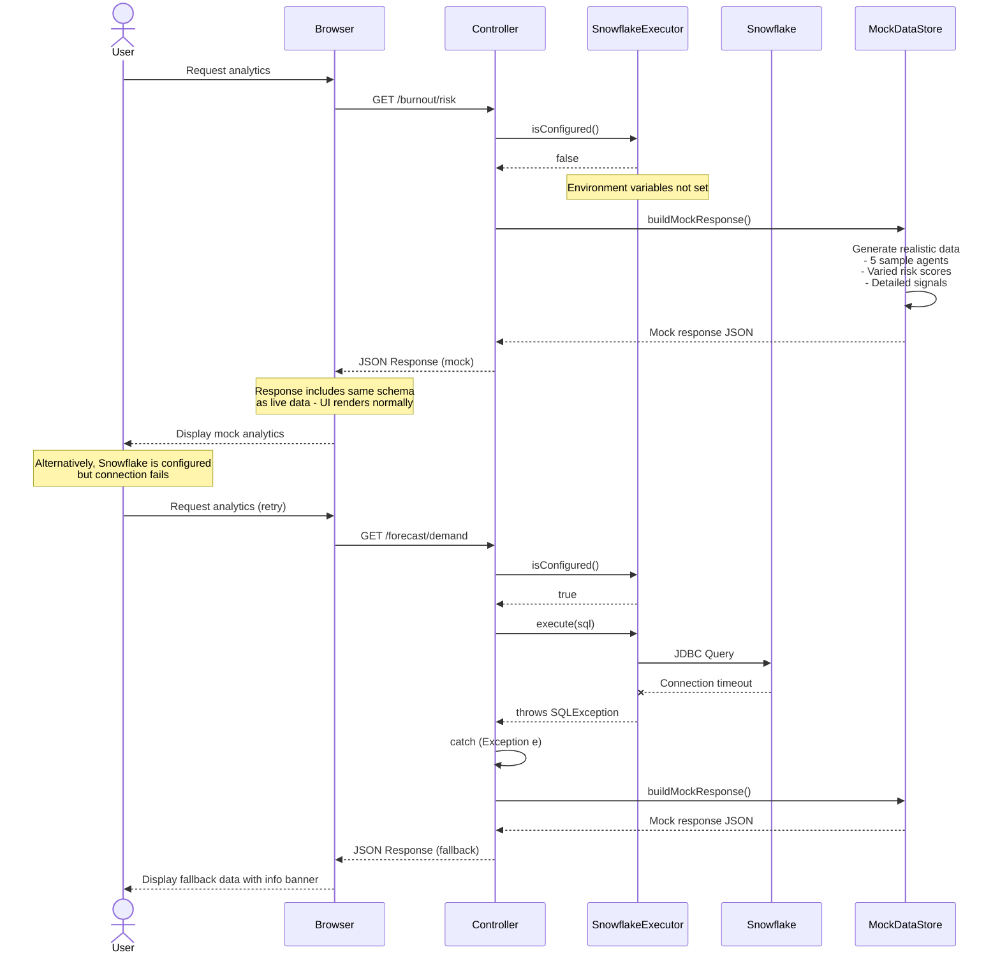
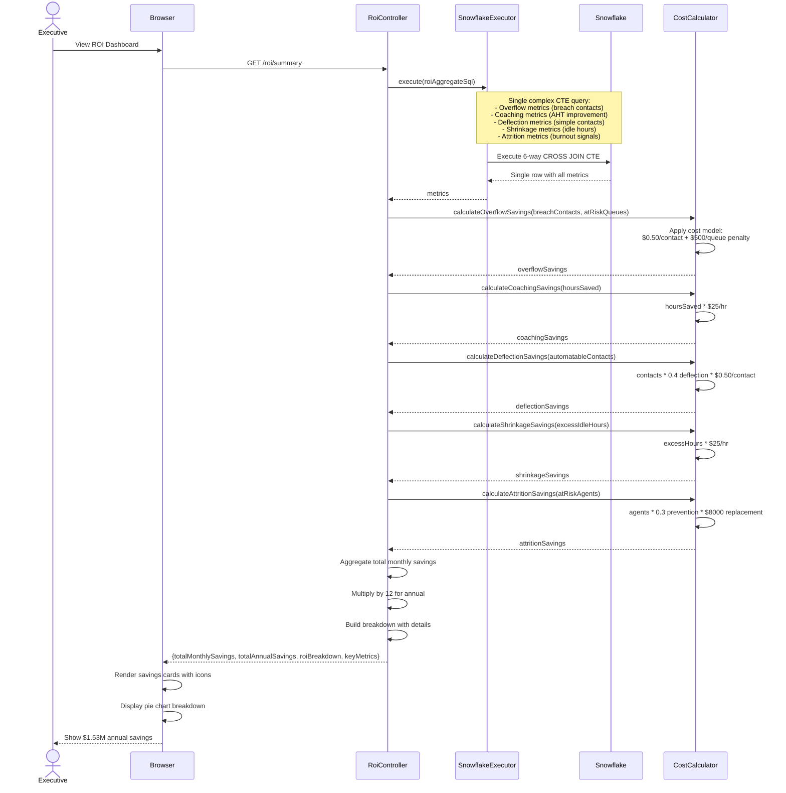
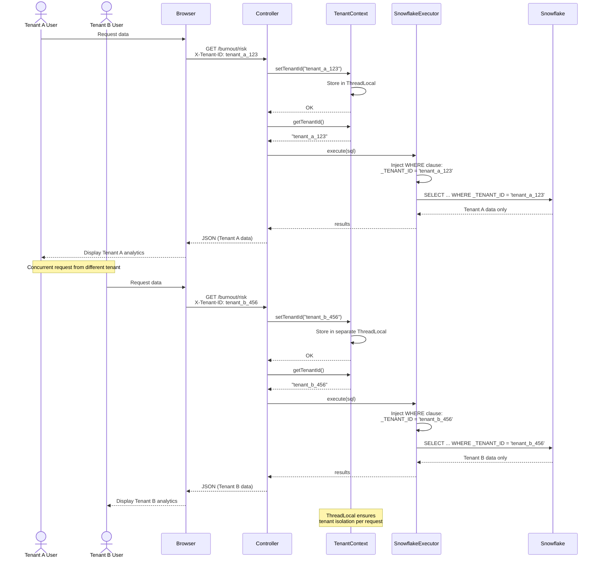

# Sequence Diagrams - Agentic RCA Sample Platform

This document provides detailed sequence diagrams for key user flows and system interactions.

## 1. Standard Analytics Request Flow

This sequence shows the typical flow for any analytics endpoint (e.g., Smart Overflow, Burnout Risk, Anomaly Detection).

## 2. AI-Enhanced Daily Briefing Flow

This sequence demonstrates the LLM integration for the Daily Briefing feature.

## 3. What-If Staffing Simulation Flow

This sequence shows the interactive staffing simulator with Erlang-C calculations.

## 4. Smart Overflow Parallel Query Flow

This sequence demonstrates parallel query execution using CompletableFuture.

## 5. Anomaly Detection Z-Score Analysis Flow

This sequence shows the statistical anomaly detection process.

## 6. Graceful Fallback Flow (Snowflake Unavailable)

This sequence demonstrates the resilient fallback mechanism.

## 7. ROI Dashboard Aggregation Flow

This sequence shows the comprehensive ROI calculation across all modules.

## 8. Multi-Tenant Request Isolation Flow

This sequence demonstrates tenant context extraction and SQL scoping.

---

**Diagram Notes:**
- All sequence diagrams use Mermaid syntax for portability
- Timing annotations show async operations (par blocks) and iterations (loop blocks)
- Error paths demonstrate graceful degradation
- Multi-tenant isolation patterns ensure data security
